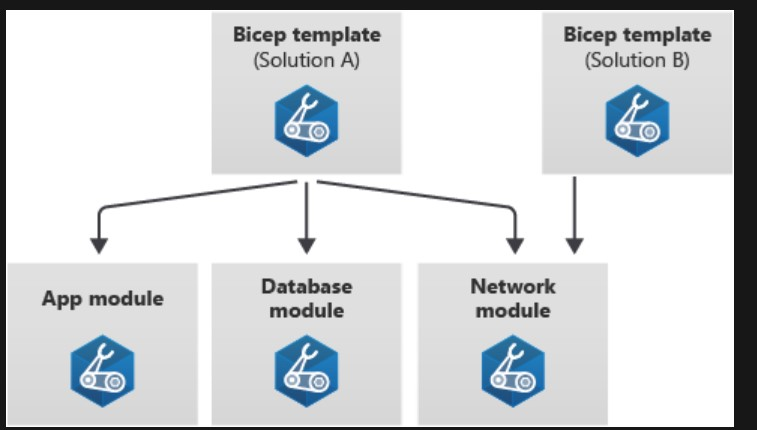

# Bicep Modules

Bicep modules allow you to organize and reuse your Bicep code by creating smaller units that can be composed into a template. Any Bicep template can be used as a module by another template. 

Your Bicep code is becoming more complex and has an increasing number of resources defined, so it's better if you can make the code more modularized.

You can create individual Bicep files, called modules, for different parts of your deployment. The main Bicep template can reference these modules. Behind the scenes, modules are transpiled into a single JSON template for deployment.

Modules are also a way to make Bicep code even more reusable. You can have a single Bicep module that many other Bicep templates use.

Imagine you have a Bicep template that deploys application, database, and networking resources for solution A. You might split this template into three modules, each of which is focused on its own set of resources. As a bonus, you can now reuse the modules in other templates for other solutions too. So when you develop a template for solution B, which has similar networking requirements to solution A, you can reuse the network module.

Diagram that shows a template for solution A referencing three modules: application, database, and networking. The networking module is then reused in another template for solution B.

When you want the template to include a reference to a module file, use the module keyword. A module definition looks similar to a resource declaration, but instead of including a resource type and API version, you'll use the module's file name:

module myModule 'modules/mymodule.bicep' = {
  name: 'MyModule'
  params: {
    location: location
  }
}

Let's look closely at some key parts of this module definition:

The *module* keyword tells Bicep you're about to use another Bicep file as a module.
Just like resources, modules need a symbolic name like *myModule*. You'll use the symbolic name when you refer to the module's outputs in other parts of the template.
*modules/mymodule.bicep* is the path to the module file, relative to the template file. Remember, a module file is just a regular Bicep file.

Just like resources, the *name* property is mandatory. Azure uses the name of the module because it creates a separate deployment for each module within the template file. Those deployments have names you can use to identify them.

You can specify any parameters of the module by using the *params* keyword. When you set the values of each parameter within the template, you can use expressions, template parameters, variables, properties of resources deployed within the template, and outputs from other modules. Bicep will automatically understand the dependencies between the resources.

# Design your modules

A good Bicep module follows some key principles:

- A module should have a clear purpose. You can use modules to define all of the resources related to a specific part of your solution. For example, you might create a module that contains all of the resources used to monitor your application. You might also use a module to define a set of resources that belong together, like all of your database servers and databases.

- Don't put every resource into its own module. You shouldn't create a separate module for every resource you deploy. If you have a resource that has lots of complex properties, it might make sense to put that resource into its own module. But in general, it's better for modules to combine multiple resources.

- A module should have clear parameters and outputs that make sense. Consider the purpose of the module. Think about whether the module should manipulate parameter values, or whether the parent template should handle that, and then pass a single value through to the module. Similarly, think about the outputs a module should return, and make sure they're useful to the templates that will use the module.

- A module should be as self-contained as possible. If a module needs to use a variable to define a part of a module, the variable should generally be included in the module file rather than in the parent template.

- A module should not output secrets. Just like templates, don't create module outputs for secret values like connection strings or keys.

# Outputs

You also will often need to emit outputs from the Bicep modules and templates. Outputs are a way for your Bicep code to send data back to whoever or whatever started the deployment.

Bicep templates can be deployed manually by a human, or they can be deployed by some sort of automated release process. Either way, it's common to have some data from the template you need to send back to whoever or whatever is executing the template deployment.

Here are some example scenarios where you might need to get information from the template deployment:

- You create a Bicep template that deploys a virtual machine, and you need to get the public IP address so you can SSH into the machine.
- You create a Bicep template that accepts a set of parameters, like an environment name and an application name. The template uses an expression to create the name of an Azure App Service app that it deploys. You need to output the name of the app the template has deployed so it can be used within a deployment pipeline to publish the application binaries.

You can use outputs for these scenarios. To define an output in a Bicep template, use the output keyword like this:

output appServiceAppName string = appServiceAppName

The output definition includes a few key parts:

The *output* keyword tells Bicep you're defining an output.

*appServiceAppName* is the name of the output. When someone deploys the template successfully, the output values will include the name you specified so they can access the values they're expecting.

*string* is the type of the output. Bicep outputs support the same types as parameters.

A value must be specified for each output. Unlike parameters, outputs always need to have values. Output values can be expressions, references to parameters or variables, or properties of resources that are deployed within the file.

# Modules and outputs

Just like templates, Bicep modules can define outputs. It's common to chain modules together within a template. In that case, the output from one module can be a parameter for another module. By using modules and outputs together, you can create powerful and reusable Bicep files.

# Resources

[https://www.youtube.com/watch?v=yOjQqXlpXEk]

[https://learn.microsoft.com/en-gb/shows/learn-live/use-bicep-deploy-azure-infrastructure-as-code-ep03-build-reusable-bicep-templates-by-using-parameters?WT.mc_id=learnlive-20220322A]

[https://learn.microsoft.com/nl-nl/azure/azure-resource-manager/bicep/]
