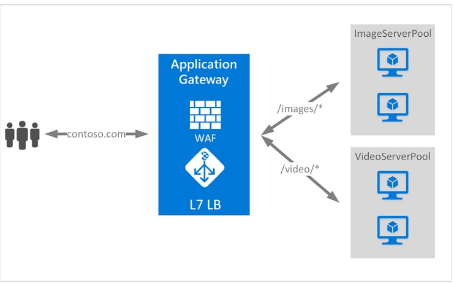
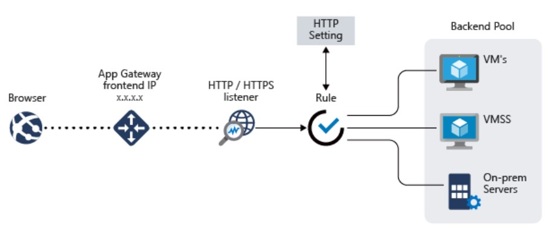

# Application Gateway

Azure Application Gateway is a web traffic load balancer that enables you to manage traffic to your web applications. Traditional load balancers operate at the transport layer (OSI layer 4 - TCP and UDP) and route traffic based on source IP address and port, to a destination IP address and port.

Application Gateway can make routing decisions based on additional attributes of an HTTP request, for example URI path or host headers. For example, you can route traffic based on the incoming URL. So if /images is in the incoming URL, you can route traffic to a specific set of servers (known as a pool) configured for images. If /video is in the URL, that traffic is routed to another pool that's optimized for videos.

This type of routing is known as application layer (OSI layer 7) load balancing. Azure Application Gateway can do URL-based routing and more.

# Note

Azure provides a suite of fully managed load-balancing solutions for your scenarios.

If you're looking to do DNS based global routing and do not have requirements for Transport Layer Security (TLS) protocol termination ("SSL offload"), per-HTTP/HTTPS request or application-layer processing, review Traffic Manager.
If you need to optimize global routing of your web traffic and optimize top-tier end-user performance and reliability through quick global failover, see Front Door.
To do transport layer load balancing, review Load Balancer.
Your end-to-end scenarios may benefit from combining these solutions as needed. For an Azure load-balancing options comparison, see Overview of load-balancing options in Azure.

Azure Application Gateway is a web traffic load balancer that enables you to manage traffic to your web applications.

# Application Gateway includes the following features:

- Secure Sockets Layer (SSL/TLS) termination

Application gateway supports SSL/TLS termination at the gateway, after which traffic typically flows unencrypted to the backend servers. This feature allows web servers to be unburdened from costly encryption and decryption overhead. But sometimes unencrypted communication to the servers isn't an acceptable option. This can be because of security requirements, compliance requirements, or the application may only accept a secure connection. For these applications, application gateway supports end to end SSL/TLS encryption.

For more information, see Overview of SSL termination and end to end SSL with Application Gateway

- Autoscaling

Application Gateway Standard_v2 supports autoscaling and can scale up or down based on changing traffic load patterns. Autoscaling also removes the requirement to choose a deployment size or instance count during provisioning.

For more information about the Application Gateway Standard_v2 features, see What is Azure Application Gateway v2?.

- Zone redundancy

A Standard_v2 Application Gateway can span multiple Availability Zones, offering better fault resiliency and removing the need to provision separate Application Gateways in each zone.

- Static VIP

The application gateway Standard_v2 SKU supports static VIP type exclusively. This ensures that the VIP associated with application gateway doesn't change even over the lifetime of the Application Gateway.

- Web Application Firewall

Web Application Firewall (WAF) is a service that provides centralized protection of your web applications from common exploits and vulnerabilities. WAF is based on rules from the OWASP (Open Web Application Security Project) core rule sets 3.1 (WAF_v2 only), 3.0, and 2.2.9.

Web applications are increasingly targets of malicious attacks that exploit common known vulnerabilities. Common among these exploits are SQL injection attacks, cross site scripting attacks to name a few. Preventing such attacks in application code can be challenging and may require rigorous maintenance, patching and monitoring at many layers of the application topology. A centralized web application firewall helps make security management much simpler and gives better assurance to application administrators against threats or intrusions. A WAF solution can also react to a security threat faster by patching a known vulnerability at a central location versus securing each of individual web applications. Existing application gateways can be converted to a Web Application Firewall enabled application gateway easily.

Refer to Application DDoS protection for guidance on how to use Azure WAF with Application Gateway to protect against DDoS attacks. For more information, see What is Azure Web Application Firewall?.

- Ingress Controller for AKS

Application Gateway Ingress Controller (AGIC) allows you to use Application Gateway as the ingress for an Azure Kubernetes Service (AKS) cluster.

The ingress controller runs as a pod within the AKS cluster and consumes Kubernetes Ingress Resources and converts them to an Application Gateway configuration, which allows the gateway to load-balance traffic to the Kubernetes pods. The ingress controller only supports Application Gateway Standard_v2 and WAF_v2 SKUs.

For more information, see Application Gateway Ingress Controller (AGIC).

- URL-based routing

URL Path Based Routing allows you to route traffic to backend server pools based on URL Paths of the request. One of the scenarios is to route requests for different content types to different pool.

For example, requests for http://contoso.com/video/* are routed to VideoServerPool, and http://contoso.com/images/* are routed to ImageServerPool. DefaultServerPool is selected if none of the path patterns match.

For more information, see URL Path Based Routing overview.

- Multiple-site hosting

With Application Gateway, you can configure routing based on host name or domain name for more than one web application on the same application gateway. It allows you to configure a more efficient topology for your deployments by adding up to 100+ websites to one application gateway. Each website can be directed to its own backend pool. For example, three domains, contoso.com, fabrikam.com, and adatum.com, point to the IP address of the application gateway. You'd create three multi-site listeners and configure each listener for the respective port and protocol setting.

Requests for http://contoso.com are routed to ContosoServerPool, http://fabrikam.com are routed to FabrikamServerPool, and so on.

Similarly, two subdomains of the same parent domain can be hosted on the same application gateway deployment. Examples of using subdomains could include http://blog.contoso.com and http://app.contoso.com hosted on a single application gateway deployment. For more information, see Application Gateway multiple site hosting.

You can also define wildcard host names in a multi-site listener and up to 5 host names per listener. To learn more, see wildcard host names in listener.

- Redirection

A common scenario for many web applications is to support automatic HTTP to HTTPS redirection to ensure all communication between an application and its users occurs over an encrypted path.

In the past, you may have used techniques such as dedicated pool creation whose sole purpose is to redirect requests it receives on HTTP to HTTPS. Application gateway supports the ability to redirect traffic on the Application Gateway. This simplifies application configuration, optimizes the resource usage, and supports new redirection scenarios, including global and path-based redirection. Application Gateway redirection support isn't limited to HTTP to HTTPS redirection alone. This is a generic redirection mechanism, so you can redirect from and to any port you define using rules. It also supports redirection to an external site as well.

Application Gateway redirection support offers the following capabilities:

Global redirection from one port to another port on the Gateway. This enables HTTP to HTTPS redirection on a site.
Path-based redirection. This type of redirection enables HTTP to HTTPS redirection only on a specific site area, for example a shopping cart area denoted by /cart/*.
Redirect to an external site.
For more information, see Application Gateway redirect overview.

- Session affinity

The cookie-based session affinity feature is useful when you want to keep a user session on the same server. Using gateway-managed cookies, the Application Gateway can direct subsequent traffic from a user session to the same server for processing. This is important in cases where session state is saved locally on the server for a user session.

For more information, see How an application gateway works.

- Websocket and HTTP/2 traffic

Application Gateway provides native support for the WebSocket and HTTP/2 protocols. There's no user-configurable setting to selectively enable or disable WebSocket support.

The WebSocket and HTTP/2 protocols enable full duplex communication between a server and a client over a long running TCP connection. This allows for a more interactive communication between the web server and the client, which can be bidirectional without the need for polling as required in HTTP-based implementations. These protocols have low overhead, unlike HTTP, and can reuse the same TCP connection for multiple request/responses resulting in a more efficient resource utilization. These protocols are designed to work over traditional HTTP ports of 80 and 443.

For more information, see WebSocket support and HTTP/2 support.

- Connection draining

Connection draining helps you achieve graceful removal of backend pool members during planned service updates or problems with backend health. This setting is enabled via the Backend Setting and is applied to all backend pool members during rule creation. Once enabled, the application gateway ensures all deregistering instances of a backend pool don't receive any new requests while allowing existing requests to complete within a configured time limit. It applies to cases where backend instances are:

explicitly removed from the backend pool after a configuration change by a user
reported as unhealthy by the health probes, or removed during a scale-in operation
The only exception is when requests continue to be proxied to the deregistering instances because of gateway-managed session affinity.

The connection draining is honored for WebSocket connections as well. Connection draining is invoked for every single update to the gateway. To prevent connection loss to existing members of the backend pool, make sure to enable connection draining.

For information on time limits, see Backend Settings configuration.

- Custom error pages

Application Gateway allows you to create custom error pages instead of displaying default error pages. You can use your own branding and layout using a custom error page.

For more information, see Custom Errors.

- Rewrite HTTP headers and URL

HTTP headers allow the client and server to pass additional information with the request or the response. Rewriting these HTTP headers helps you accomplish several important scenarios, such as:

Adding security-related header fields like HSTS/ X-XSS-Protection.
Removing response header fields that can reveal sensitive information.
Stripping port information from X-Forwarded-For headers.
Application Gateway and WAF v2 SKU supports the capability to add, remove, or update HTTP request and response headers, while the request and response packets move between the client and backend pools. You can also rewrite URLs, query string parameters and host name. With URL rewrite and URL path-based routing, you can choose to either route requests to one of the backend pools based on the original path or the rewritten path, using the reevaluate path map option.

It also provides you with the capability to add conditions to ensure the specified headers or URL are rewritten only when certain conditions are met. These conditions are based on the request and response information.

For more information, see Rewrite HTTP headers and URL.

- Sizing

Application Gateway Standard_v2 can be configured for autoscaling or fixed size deployments. The v2 SKU doesn't offer different instance sizes. For more information on v2 performance and pricing, see Autoscaling V2 and Understanding pricing.

The Application Gateway Standard (v1) is offered in three sizes: Small, Medium, and Large. Small instance sizes are intended for development and testing scenarios.

# How an application gateway works

- How an application gateway accepts a request

Before a client sends a request to an application gateway, it resolves the domain name of the application gateway by using a Domain Name System (DNS) server. Azure controls the DNS entry because all application gateways are in the azure.com domain.

The Azure DNS returns the IP address to the client, which is the frontend IP address of the application gateway.

The application gateway accepts incoming traffic on one or more listeners. A listener is a logical entity that checks for connection requests. It's configured with a frontend IP address, protocol, and port number for connections from clients to the application gateway.

If a web application firewall (WAF) is in use, the application gateway checks the request headers and the body, if present, against WAF rules. This action determines if the request is valid request or a security threat. If the request is valid, it's routed to the backend. If the request isn't valid and WAF is in Prevention mode, it's blocked as a security threat. If it's in Detection mode, the request is evaluated and logged, but still forwarded to the backend server.

Azure Application Gateway can be used as an internal application load balancer or as an internet-facing application load balancer. An internet-facing application gateway uses public IP addresses. The DNS name of an internet-facing application gateway is publicly resolvable to its public IP address. As a result, internet-facing application gateways can route client requests from the internet.

Internal application gateways use only private IP addresses. If you're using a Custom or Private DNS zone, the domain name should be internally resolvable to the private IP address of the Application Gateway. Therefore, internal load-balancers can only route requests from clients with access to a virtual network for the application gateway.

- How an application gateway routes a request

If a request is valid and not blocked by WAF, the application gateway evaluates the request routing rule that's associated with the listener. This action determines which backend pool to route the request to.

Based on the request routing rule, the application gateway determines whether to route all requests on the listener to a specific backend pool, route requests to different backend pools based on the URL path, or redirect requests to another port or external site.

# Note

Rules are processed in the order they're listed in the portal for v1 SKU.

When the application gateway selects the backend pool, it sends the request to one of the healthy backend servers in the pool (y.y.y.y). The health of the server is determined by a health probe. If the backend pool contains multiple servers, the application gateway uses a round-robin algorithm to route the requests between healthy servers. This load balances the requests on the servers.

After the application gateway determines the backend server, it opens a new TCP session with the backend server based on HTTP settings. HTTP settings specify the protocol, port, and other routing-related settings that are required to establish a new session with the backend server.

The port and protocol used in HTTP settings determine whether the traffic between the application gateway and backend servers is encrypted (thus accomplishing end-to-end TLS) or is unencrypted.

When an application gateway sends the original request to the backend server, it honors any custom configuration made in the HTTP settings related to overriding the hostname, path, and protocol. This action maintains cookie-based session affinity, connection draining, host-name selection from the backend, and so on.

# Note

If the backend pool:

Is a public endpoint, the application gateway uses its frontend public IP to reach the server. If there isn't a frontend public IP address, one is assigned for the outbound external connectivity.
Contains an internally resolvable FQDN or a private IP address, the application gateway routes the request to the backend server by using its instance private IP addresses.
Contains an external endpoint or an externally resolvable FQDN, the application gateway routes the request to the backend server by using its frontend public IP address. If the subnet contains service endpoints, the application gateway will route the request to the service via its private IP address. DNS resolution is based on a private DNS zone or custom DNS server, if configured, or it uses the default Azure-provided DNS. If there isn't a frontend public IP address, one is assigned for the outbound external connectivity.

- Backend server DNS resolution

When a backend pool's server is configured with a Fully Qualified Domain Name (FQDN), Application Gateway performs a DNS lookup to get the domain name's IP address(es). The IP value is stored in your application gateway's cache to enable it to reach the targets faster when serving incoming requests.

The Application Gateway retains this cached information for the period equivalent to that DNS record's TTL (time to live) and performs a fresh DNS lookup once the TTL expires. If a gateway detects a change in IP address for its subsequent DNS query, it will start routing the traffic to this updated destination. In case of problems such as the DNS lookup failing to receive a response or the record no longer exists, the gateway continues to use the last-known-good IP address(es). This ensures minimal impact on the data path.

# Important

When using custom DNS servers with Application Gateway's Virtual Network, it is crucial that all servers are identical and respond consistently with the same DNS values.
Users of on-premises custom DNS servers must ensure connectivity to Azure DNS through Azure DNS Private Resolver (recommended) or DNS forwarder VM when using a Private DNS zone for Private endpoint.

- Modifications to the request

Application gateway inserts six additional headers to all requests before it forwards the requests to the backend. These headers are x-forwarded-for, x-forwarded-port, x-forwarded-proto, x-original-host, x-original-url, and x-appgw-trace-id. The format for x-forwarded-for header is a comma-separated list of IP:port.

The valid values for x-forwarded-proto are HTTP or HTTPS. X-forwarded-port specifies the port where the request reached the application gateway. X-original-host header contains the original host header with which the request arrived. This header is useful in Azure website integration, where the incoming host header is modified before traffic is routed to the backend. If session affinity is enabled as an option, then it adds a gateway-managed affinity cookie.

X-appgw-trace-id is a unique guid generated by application gateway for each client request and presented in the forwarded request to the backend pool member. The guid consists of 32 alphanumeric characters presented without dashes (for example: ac882cd65a2712a0fe1289ec2bb6aee7). This guid can be used to correlate a request received by application gateway and initiated to a backend pool member via the transactionId property in Diagnostic Logs.

You can configure application gateway to modify request and response headers and URL by using Rewrite HTTP headers and URL or to modify the URI path by using a path-override setting. However, unless configured to do so, all incoming requests are proxied to the backend.

# Resources

[https://learn.microsoft.com/en-us/azure/application-gateway/overview]

[https://learn.microsoft.com/en-us/azure/application-gateway/features]

[https://learn.microsoft.com/en-us/azure/application-gateway/how-application-gateway-works]

[https://learn.microsoft.com/en-us/azure/application-gateway/redirect-http-to-https-cli]

[https://learn.microsoft.com/en-us/azure/application-gateway/quick-create-bicep?tabs=CLI]

[https://www.youtube.com/watch?v=B3O6bXu-NbM]

[https://learn.microsoft.com/en-us/azure/application-gateway/application-gateway-probe-overview]

