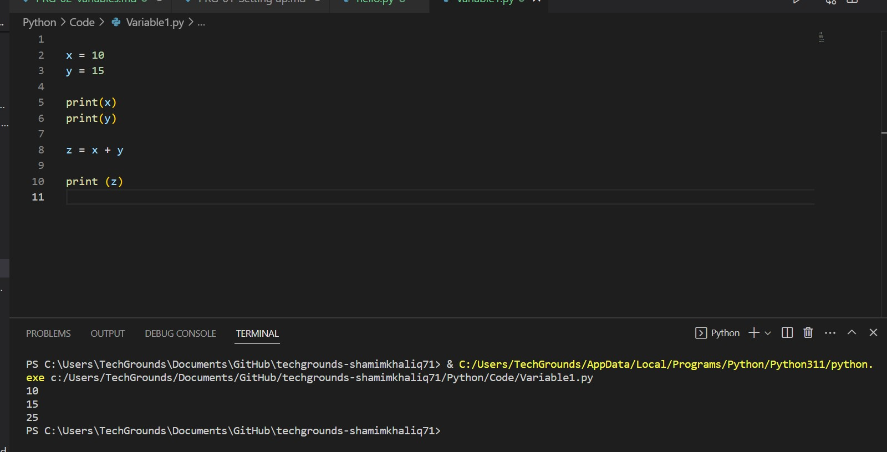
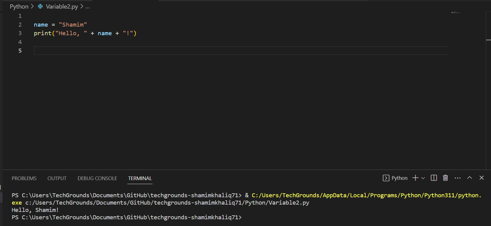
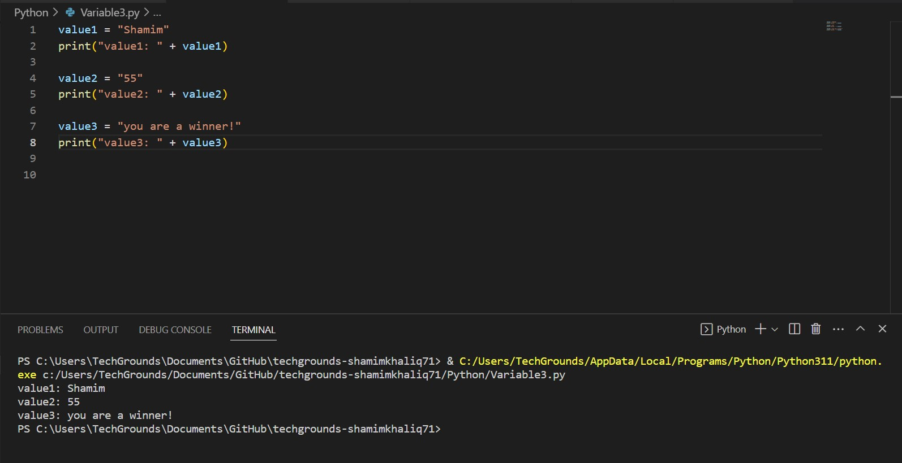

# Variables

Introduction:
A variable can store a value. This value can then be accessed with the variable name in the code. This is useful if you want to use one value multiple times, or if you want to dynamically change the value.

A variable name can be any string of characters (except for some special cases that are reserved for other use). It is a best practice to use variable names that are short, but also clear. For example, a variable that stores user input might be named input or usr_inpt.

Remember that at any time in the code, you can put a print statement to read the current value of a variable. This is useful when trying to find a bug in a script.

Requirements:
Python
VS Code

## Key-terms

Variables
print

## Opdracht

Exercise 1:
Create a new script.
Create two variables x and y. Assign a numerical value to both variables.
Print the values of x and y.
Create a third variable named z. The value of z should be the sum of x and y.
Print the value of z.

Exercise 2:
Create a new script.
Create a variable name. The value of name should be your name.
Print the text “Hello, <your name here>!”. Use name in the print statement.
Example output:

Exercise 3:
Create a new script.
Create a variable and assign a value to it.
Print the text “Value 1: <value 1 here>”.
Change the value of that same variable.
Print the text “Value 2: <value 2 here>”.
Change the value of that same variable.
Print the text “Value 3: <value 3 here>”.
Example output:

### Gebruikte bronnen

[https://www.youtube.com/watch?v=TqPzwenhMj0]
[https://www.youtube.com/watch?v=i83VkP0LHPI&list=PL98qAXLA6afuh50qD2MdAj3ofYjZR_Phn&t=14s]

### Ervaren problemen
Im new to Python, so got some errors, but mainly because I used capital letters and should have read some stuff better.

### Resultaat
See screenhots