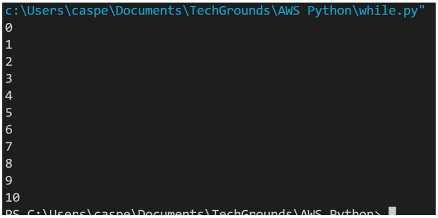

# Loops

You can use loops when you want to run a block of code multiple times. For example, you might want to do an operation on every item in a (large) list, or you want to write an algorithm that follows the same set of instructions for multiple iterations.
There are two types of loops in Python: the while loop and the for loop.

The while loop runs while a condition is true. They can run indefinitely if that condition never changes. If your code is stuck in an infinite loop, just press ctrl-c (or command-c on MacOS) to force quit the running code.

The for loop runs for a predetermined number of iterations. This number can be hard coded using the range() function, or dynamically assigned (using a variable, the size of a list, or the number of lines in a document). It is also possible to accidentally create an infinite for loop. You can use the same command (ctrl/cmd+c) to exit your program.

Requirements:
Python
VS Code

## Key-terms

loops: When you want to run a block of code multiple times. There are two types of loops.

While loop: runs while a condition is true. Also known as infinit loop, it will run untill the memory is full., however, when the statement becomes false, the loop will stop.

For loop: runs for a predetermined number of iterations.

## Opdracht

Exercise 1:

Create a new script.
Create a variable x and give it the value 0.
Use a while loop to print the value of x in every iteration of the loop. After printing, the value of x should increase by 1. The loop should run as long as x is smaller than or equal to 10.

Example output:

Result output:

### Gebruikte bronnen

[https://www.youtube.com/watch?v=5AOfDuV6X30&list=PL98qAXLA6afuh50qD2MdAj3ofYjZR_Phn&index=8]
[https://www.youtube.com/watch?v=yaqMSBr_NCU&list=PL98qAXLA6afuh50qD2MdAj3ofYjZR_Phn&index=10]

### Ervaren problemen
Needed to understand properly what a while loop was and after wathing a good video, I understood how to do the assignment.

### Resultaat
See screenshots