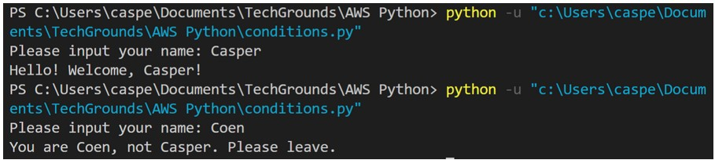
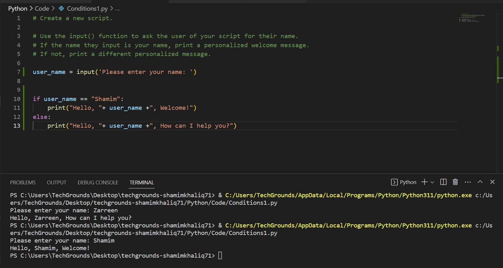
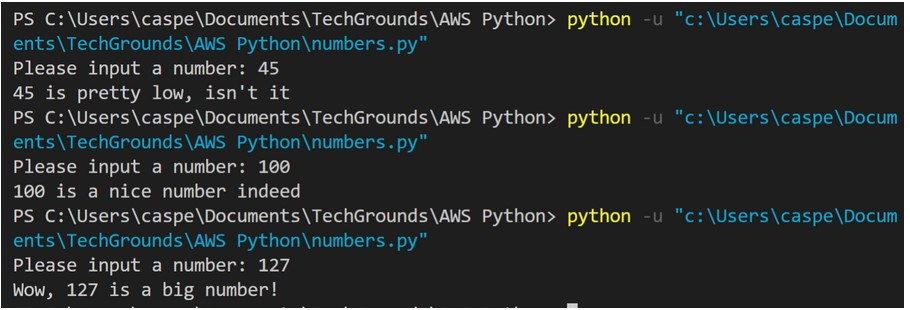
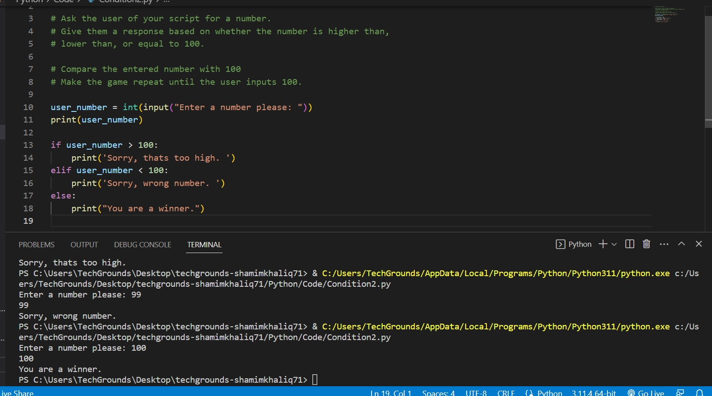

# Conditions

Very often, you will want to run a piece of code only when certain conditions are met. For example, you might want to write something to an error log only if the reply you receive from a server contains an error.

Python makes use of the if, elif, and else statements.

Requirements:
Python
VS Code

## Key-terms

Statements:
if
elif
else

## Opdracht

Exercise 1:

Create a new script.
Use the input() function to ask the user of your script for their name. If the name they input is your name, print a personalized welcome message. If not, print a different personalized message.

Example output:

Result output:

Exercise 2:

Create a new script.
Ask the user of your script for a number. Give them a response based on whether the number is higher than, lower than, or equal to 100.
Make the game repeat until the user inputs 100.

Example output:

Result output:

### Gebruikte bronnen

[https://www.programiz.com/python-programming/main-function]
[Chatgpt]

### Ervaren problemen

I found it a little bit tricky, because I kept getting a wrong output in the first assignment, but had to review it a few time to see where I was making a mistake. checked with Chatgpt and compared my input, found a little mistake and fixed it.

### Resultaat

see screenshots