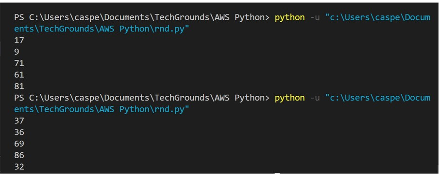
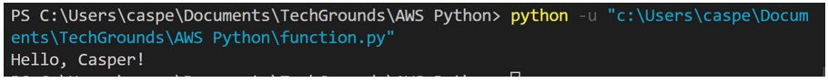
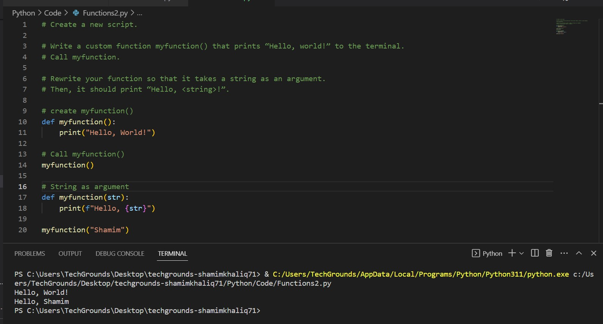

# Functions

You’ve already seen and used a couple of functions, like print() and input(). A function is a block of code that only runs when it is called. Functions are recognizable by the brackets () next to the function name. These brackets serve as a place to input data into a function.
Functions return data as a result.

Besides the built-in functions, you can also write custom functions, or import functions from a library or package.

Requirements:

Python
VS Code

## Key-terms

Functions
Print
Input
A python package:
is a collection of modules. Modules that are related to each other are mainly put in the same package. When a module from an external package is required in a program, that package can be imported and its modules can be put to use.
Random module:
is an in-built module of Python that is used to generate random numbers in Python. 

## Opdracht

Exercise 1:

Create a new script.
Import the random package.
Print 5 random integers with a value between 0 and 100.

Example output:

My output:

Exercise 2:

Create a new script.
Write a custom function myfunction() that prints “Hello, world!” to the terminal. Call myfunction.
Rewrite your function so that it takes a string as an argument. Then, it should print “Hello, <string>!”.

Example output:

My output:

Exercise 3:

Create a new script.
Copy the code below into your script.
def avg():
	# write your code here

#you are not allowed to edit any code below here

x = 128
y = 255
z = avg(x,y)

print("The average of",x,"and",y,"is",z)
Write the custom function avg() so that it returns the average of the given parameters. You are not allowed to edit any code below the second comment.

My output:

### Gebruikte bronnen

[https://www.toppr.com/guides/python-guide/tutorials/modules/modules/random/use-random-module-to-generate-random-numbers-in-python/#:~:text=0.6229016948897019%200.7417869892607294%200.7951935655656966-,Python%20Program%20to%20Generate%20Random%20Floats,arguments%20required%20for%20the%20function.]
[https://www.youtube.com/watch?v=-Bkupx9gX0o]

### Ervaren problemen

Not really problems, but leared different ways of writing code shorter.

### Resultaat

See screenshots