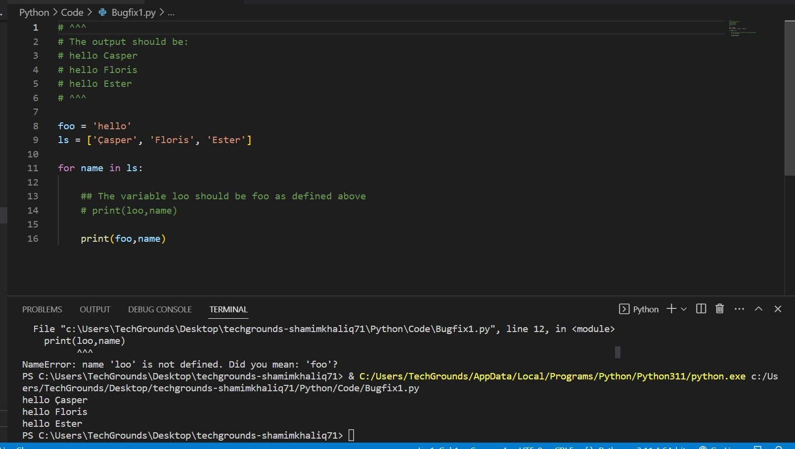
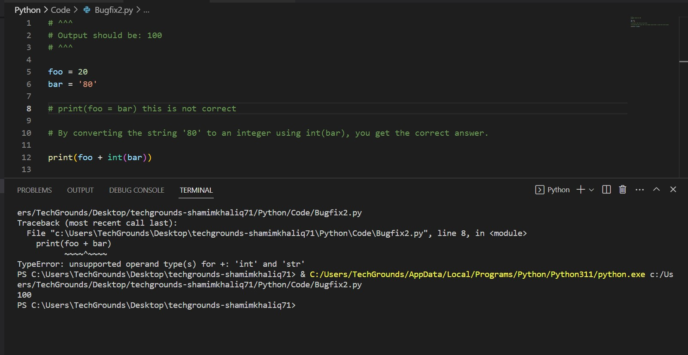

# Python bonus

You might have seen a folder in the drive named ‘Pls fix’. This folder contains 16 very small Python scripts that are somehow broken. Your job is to fix the mistake by changing only 1 or 2 small things within the script. The expected result for each script is written in the multi-line comment at the top of the script.

This exercise is meant as a little fun puzzle, but also to help you learn to troubleshoot existing code, so even though they are optional, they are recommended to do.
Of course, you can get to the expected results by simply deleting all the code and using a print function, but that would defeat the purpose of this exercise.

The exercises are approximately ordered based on difficulty level, but you might want to skip one if you get stuck and go back to that one later

Requirements:
VS Code
The scripts in Pls fix

## Key-terms
[Schrijf hier een lijst met belangrijke termen met eventueel een korte uitleg.]

## Opdracht

Exercise:

Fix the 16 broken Python scripts

Bugfix 1:

Bugfix 2:

### Gebruikte bronnen

### Ervaren problemen
[Geef een korte beschrijving van de problemen waar je tegenaan bent gelopen met je gevonden oplossing.]

### Resultaat
[Omschrijf hoe je weet dat je opdracht gelukt is (gebruik screenshots waar nodig).]